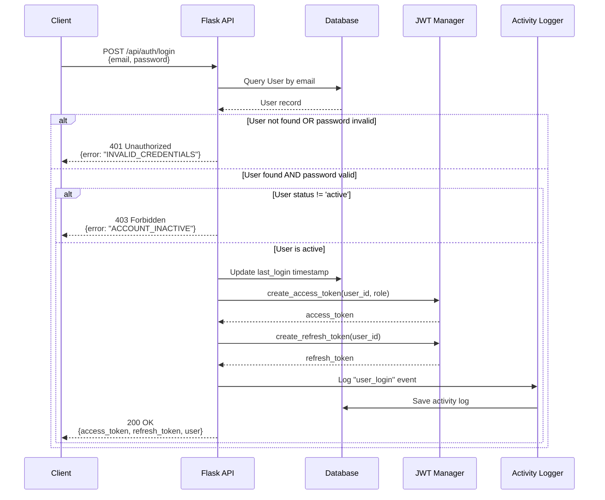
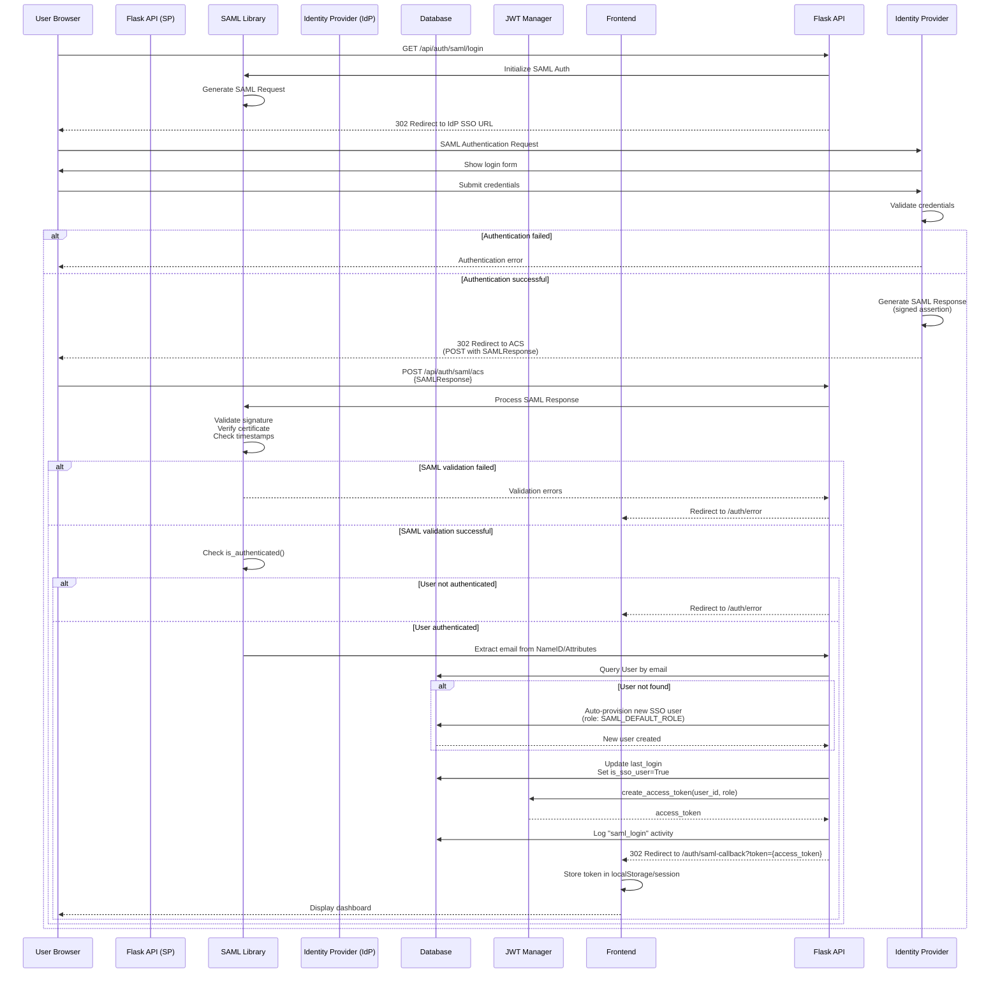
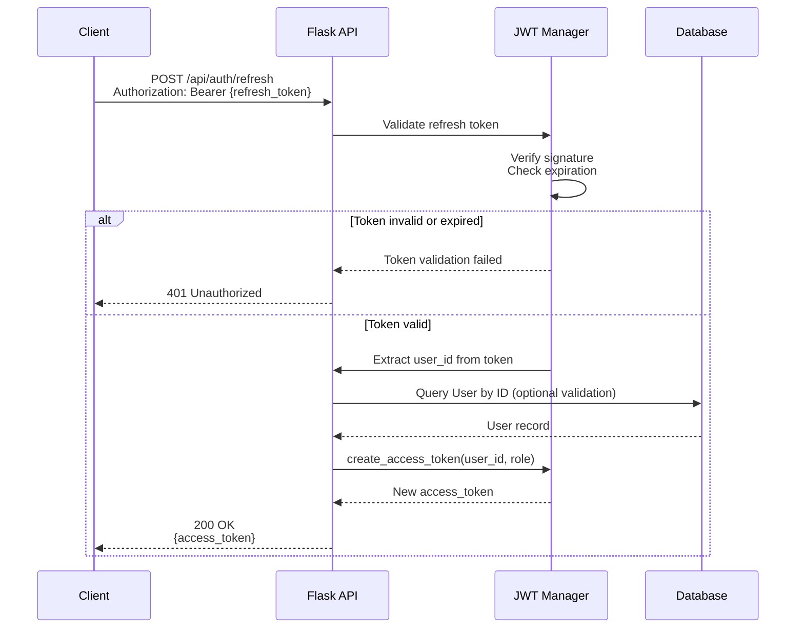
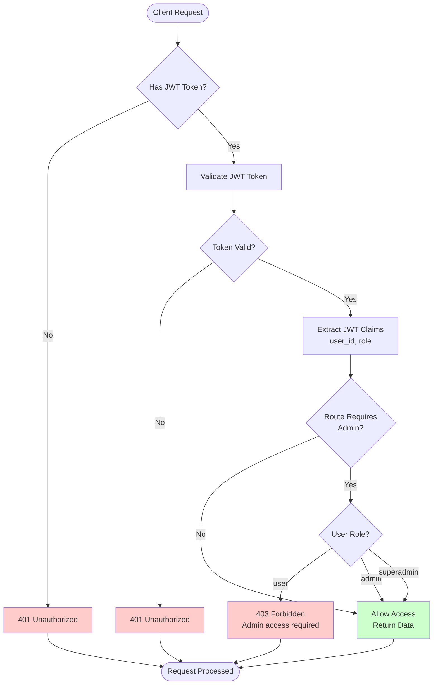
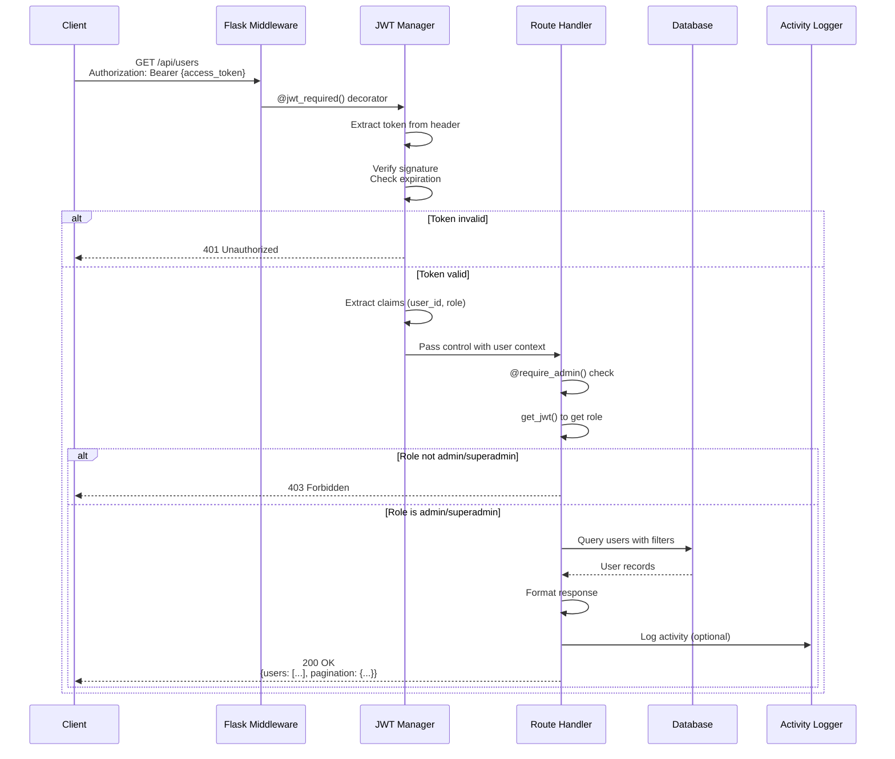
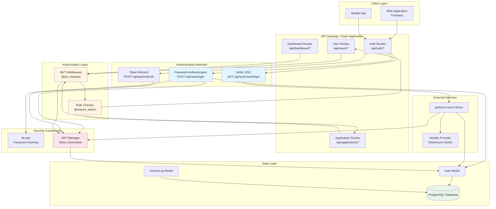
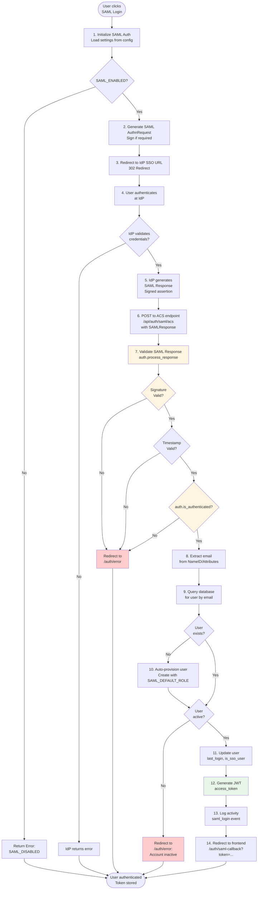
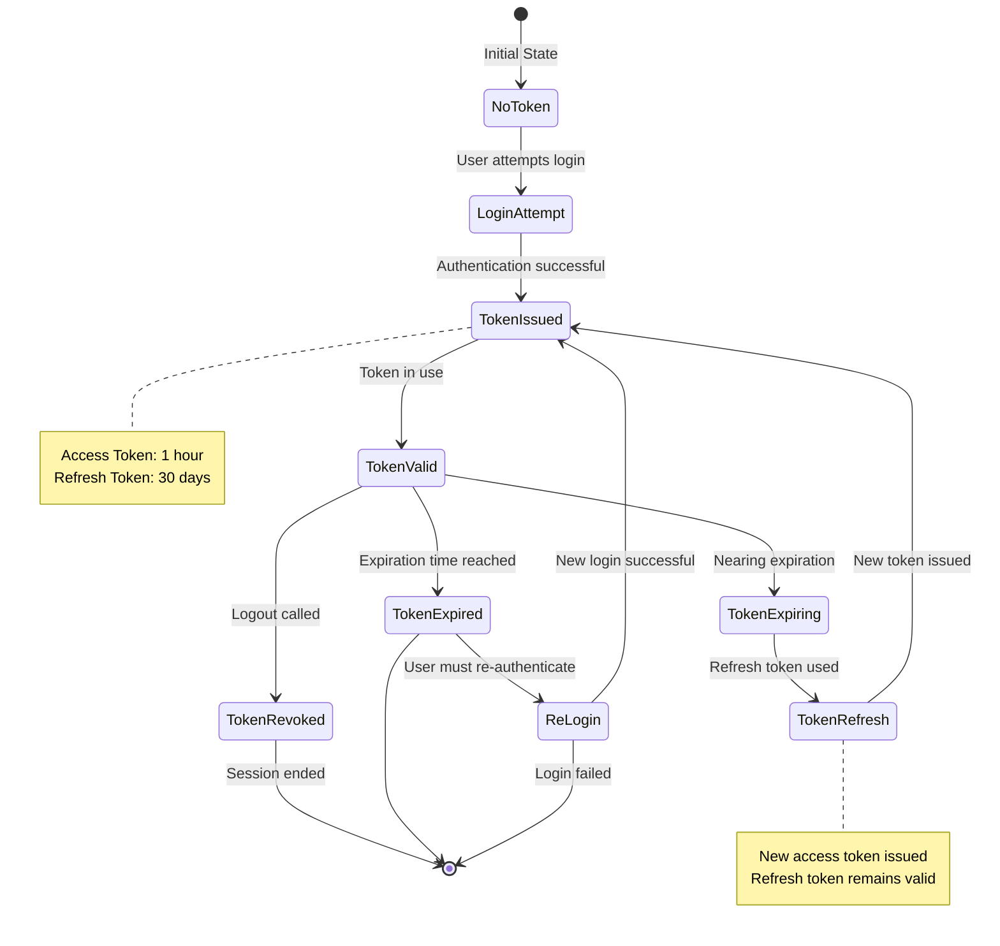
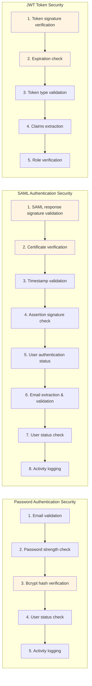

# Authentication & Authorization Flow Diagrams

This document provides comprehensive flowcharts showing how authentication and authorization work in the Flask Admin Dashboard.

## Table of Contents
1. [Password-Based Authentication Flow](#1-password-based-authentication-flow)
2. [SAML SSO Authentication Flow](#2-saml-sso-authentication-flow)
3. [JWT Token Refresh Flow](#3-jwt-token-refresh-flow)
4. [Authorization & Role-Based Access Control](#4-authorization--role-based-access-control)
5. [Protected Route Access Flow](#5-protected-route-access-flow)
6. [Complete Authentication Architecture](#6-complete-authentication-architecture)

---

## 1. Password-Based Authentication Flow



---

## 2. SAML SSO Authentication Flow



---

## 3. JWT Token Refresh Flow



---

## 4. Authorization & Role-Based Access Control



### Role Hierarchy

```
┌─────────────────────────────────────────┐
│         superadmin                      │
│  (Highest privileges - all access)     │
└─────────────────────────────────────────┘
              │
              ▼
┌─────────────────────────────────────────┐
│         admin                           │
│  (User management, application mgmt)  │
└─────────────────────────────────────────┘
              │
              ▼
┌─────────────────────────────────────────┐
│         user                            │
│  (Basic access - view own data)         │
└─────────────────────────────────────────┘
```

### Role Permissions Matrix

| Endpoint | user | admin | superadmin |
|----------|------|-------|------------|
| `GET /api/users` | ❌ | ✅ | ✅ |
| `POST /api/users` | ❌ | ✅ | ✅ |
| `PUT /api/users/:id` | ❌ | ✅ | ✅ |
| `DELETE /api/users/:id` | ❌ | ✅ | ✅ |
| `GET /api/applications` | ✅ | ✅ | ✅ |
| `POST /api/applications` | ❌ | ✅ | ✅ |
| `GET /api/dashboard/stats` | ✅ | ✅ | ✅ |
| `GET /api/auth/me` | ✅ | ✅ | ✅ |

---

## 5. Protected Route Access Flow



---

## 6. Complete Authentication Architecture



---

## 7. Detailed SAML SSO Flow (Step-by-Step)



---

## 8. Token Lifecycle



---

## 9. Security Validation Points



---

## Key Components Summary

### Authentication Endpoints
- `POST /api/auth/login` - Password-based login
- `GET /api/auth/saml/login` - Initiate SAML SSO
- `POST /api/auth/saml/acs` - SAML Assertion Consumer Service
- `GET /api/auth/saml/metadata` - SAML SP metadata
- `POST /api/auth/refresh` - Refresh access token
- `POST /api/auth/logout` - Logout user
- `GET /api/auth/me` - Get current user

### Authorization Decorators
- `@jwt_required()` - Requires valid JWT token
- `@jwt_required(refresh=True)` - Requires refresh token
- `@require_admin()` - Requires admin or superadmin role
- `@validate_json_body(Schema)` - Validates request body
- `@validate_query_params(Schema)` - Validates query parameters

### Security Features
- ✅ Password hashing with bcrypt
- ✅ JWT token-based authentication
- ✅ SAML 2.0 SSO with signature validation
- ✅ Role-based access control (RBAC)
- ✅ Activity logging for audit trail
- ✅ Token expiration and refresh mechanism
- ✅ Auto-provisioning for SSO users
- ✅ Secure session management

---

## Notes

1. **SAML Security**: All SAML responses are cryptographically validated before processing
2. **Token Storage**: Frontend should store tokens securely (httpOnly cookies recommended for production)
3. **Auto-provisioning**: New SSO users are automatically created with `SAML_DEFAULT_ROLE` (default: 'user')
4. **Password vs SSO**: Users can have either password-based or SSO authentication, or both
5. **Role Hierarchy**: superadmin > admin > user (each level has all permissions of lower levels)

